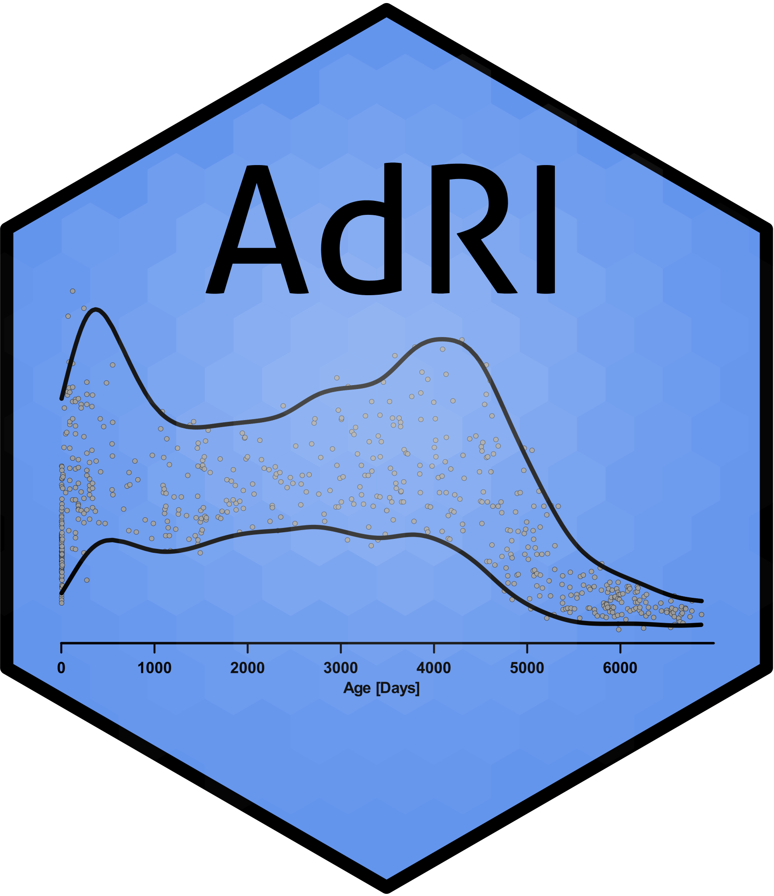
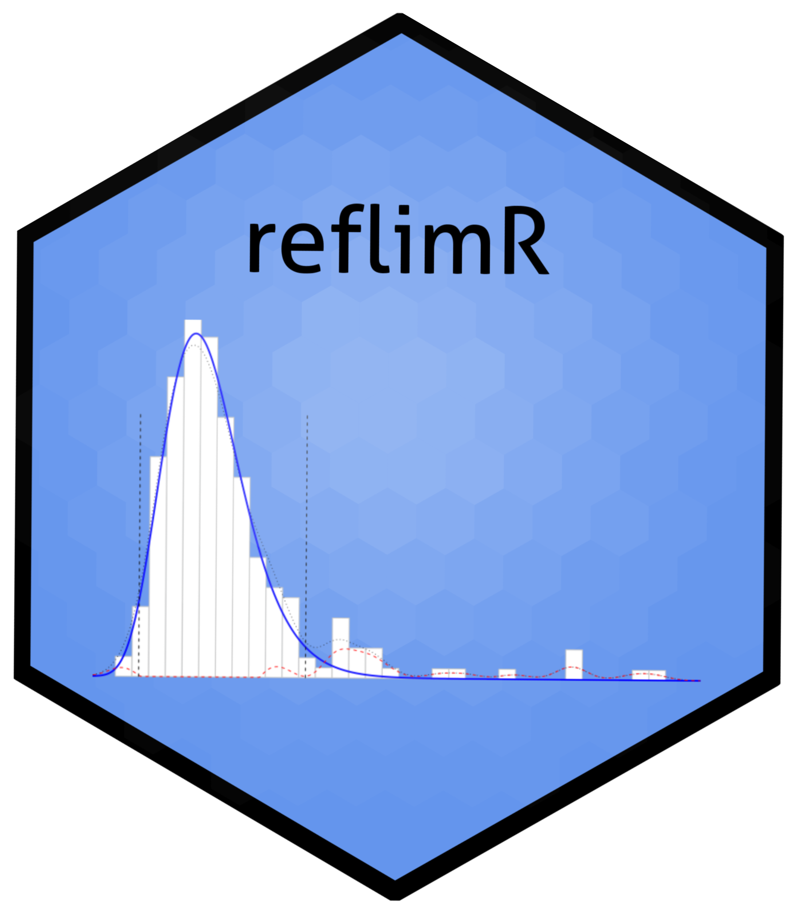

# Projects & Publications

## Project Age-dependent-Reference-Intervals

### Shiny App [AdRI](https://github.com/SandraKla/AdRI)
- create Age-dependent Reference Intervals using different methods (LMS, GAMLSS, Window-Methods and Regression) 

### Shiny App [AdRI_GAMLSS](https://github.com/SandraKla/AdRI_GAMLSS)
- [A visualization tool for continuous reference intervals based on GAMLSS](https://www.degruyter.com/document/doi/10.1515/labmed-2023-0033/html)

### Shiny App [AdRI_rpart](https://github.com/SandraKla/AdRI_rpart)
- [Automated sex and age partitioning for the estimation of reference intervals using a regression tree model](https://www.degruyter.com/document/doi/10.1515/labmed-2024-0083/html)

### Shiny App [AdRI-Generator](https://github.com/SandraKla/AdRI_Generator)
- generating age-dependent analyt-data using functions or given reference intervals

### Shiny App [Zlog_AdRI](https://github.com/SandraKla/Zlog_AdRI)
- [A zlog-based algorithm and tool for plausibility checks of reference intervals](https://www.degruyter.com/document/doi/10.1515/cclm-2022-0688/html)

### Shiny App [reflimR_Shiny](https://github.com/SandraKla/reflimR_Shiny)
- [A Novel Tool for the Rapid and Transparent Verification of Reference Intervals in Clinical Laboratories](https://doi.org/10.3390/jcm13154397)

## Cooperation on other Shiny Apps

### Shiny App for Magnetic Resonance Imaging (MRI) - [ShinySurfer](https://github.com/SandraKla/ShinySurfer)  
- [ShinySurfer: A tool for visualization and statistical analysis of cortical parameters](https://f1000research.com/posters/10-440)

### Shiny App for [GenomeNet](https://github.com/GenomeNet/GenomeNet-responseViewer)
- Visualization of state responses of GenomeNet

## Packages

### [NewickReader](https://github.com/SandraKla/NewickReader)
- read and print the simple Newick format

### [reflimR](https://github.com/reflim/reflimR)
- [reflimR - Reference Limit Estimation Using Routine Laboratory Data](https://cran.r-project.org/web/packages/reflimR/index.html)
- [A Novel Tool for the Rapid and Transparent Verification of Reference Intervals in Clinical Laboratories](https://doi.org/10.3390/jcm13154397)

## Publications

- René Mreches, Alice C. McHardy, Bernd Bischl, Julia Moosbauer, Hüseyin Anil Gündüz, Sandra Klawitter, Zhi-Luo Deng, Eric Franzosa, Curtis Huttenhower, Gary Robertson, Ehsaneddin Asgari, Xiao-Yin To, Martin Binder, & Philipp C. Münch. (2021). GenomeNet/deepG: DeepG pre-release version (v0.1.0-alpha). Zenodo. https://doi.org/10.5281/zenodo.5561229 🧬
- Klawitter, Sandra & Cai, Yixiao & Ye, Baichao & Klawonn, Frank & Sörös, Peter. (2021). ShinySurfer: A tool for visualization and statistical analysis of cortical parameters. 10.7490/f1000research.1118565.1 accepted for OHBM 2021 https://f1000research.com/posters/10-440 🧠
- Klawitter, S., Hoffmann, G., Holdenrieder, S., Kacprowski, T. & Klawonn, F. (2022). A zlog-based algorithm and tool for plausibility checks of reference intervals. Clinical Chemistry and Laboratory Medicine (CCLM). https://doi.org/10.1515/cclm-2022-0688
- Sandra Klawitter, Frank Klawonn und Georg Hoffmann. (2023). Referenzintervalle bei Kindern - Wenn Tabellen an ihre Grenzen stoßen. Trillium Diagnostik (TD) Heft 1/2023. https://doi.org/10.47184/td.2023.01.11
- Klawitter, S. & Kacprowski, T. (2023). A visualization tool for continuous reference intervals based on GAMLSS. Journal of Laboratory Medicine. https://doi.org/10.1515/labmed-2023-0033
- Hoffmann G, Klawitter S, Klawonn F (2024). _reflimR: Reference Limit Estimation Using Routine Laboratory Data_. R package version 1.0.6, <https://CRAN.R-project.org/package=reflimR>.
- Hoffmann G, Klawitter S, Trulson I, Adler J, Holdenrieder S, Klawonn F. A Novel Tool for the Rapid and Transparent Verification of Reference Intervals in Clinical Laboratories. Journal of Clinical Medicine. 2024; 13(15):4397. https://doi.org/10.3390/jcm13154397
- Al-Mekhlafi, A., Klawitter, S. & Klawonn, F. (2024). Standardization with zlog values improves exploratory data analysis and machine learning for laboratory data. Journal of Laboratory Medicine. https://doi.org/10.1515/labmed-2024-0051
- Klawitter, S., Böhm, J., Tolios, A. & Gebauer, J. (2024). Automated sex and age partitioning for the estimation of reference intervals using a regression tree model. Journal of Laboratory Medicine. https://doi.org/10.1515/labmed-2024-0083
