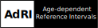

## Project Age-dependent-Reference-Intervals

### Shiny App [AdRI](https://github.com/SandraKla/Age-dependent-Reference-Intervals)
- create Age-dependent Reference Intervals using different methods (LMS, GAMLSS, Window-Methods and Regression) 

### Shiny App [AdRI-Generator](https://github.com/SandraKla/Age-dependent-Reference-Intervals_Generator)
- generating age-dependent analyt-data using functions or given reference intervals

### Shiny App [Zlog_AdRI](https://github.com/SandraKla/Zlog_AdRI)
- [A zlog-based algorithm and tool for plausibility checks of reference intervals](https://www.degruyter.com/document/doi/10.1515/cclm-2022-0688/html)

## Cooperation on other Shiny Apps

### Shiny App for Magnetic Resonance Imaging (MRI) - [ShinySurfer](https://github.com/SandraKla/ShinySurfer)  
- Software tool for the Analysis and Visualization of MRI images of the brain

### Shiny App for [GenomeNet](https://github.com/GenomeNet/GenomeNet-responseViewer)
- Visualization of state responses of GenomeNet

## Packages

### [NewickReader](https://github.com/SandraKla/NewickReader)
- read and print the simple Newick format

### Package for calculation of Reference Intervals (soon)

## Publications

- René Mreches, Alice C. McHardy, Bernd Bischl, Julia Moosbauer, Hüseyin Anil Gündüz, Sandra Klawitter, Zhi-Luo Deng, Eric Franzosa, Curtis Huttenhower, Gary Robertson, Ehsaneddin Asgari, Xiao-Yin To, Martin Binder, & Philipp C. Münch. (2021). GenomeNet/deepG: DeepG pre-release version (v0.1.0-alpha). Zenodo. https://doi.org/10.5281/zenodo.5561229 🧬
- Klawitter, Sandra & Cai, Yixiao & Ye, Baichao & Klawonn, Frank & Sörös, Peter. (2021). ShinySurfer: A tool for visualization and statistical analysis of cortical parameters. 10.7490/f1000research.1118565.1 (see [ShinySurfer](https://github.com/SandraKla/ShinySurfer)) accepted for OHBM 2021 and [F1000research.com](https://f1000research.com/posters/10-440) 🧠
- Klawitter, S., Hoffmann, G., Holdenrieder, S., Kacprowski, T. & Klawonn, F. (2022). A zlog-based algorithm and tool for plausibility checks of reference intervals. Clinical Chemistry and Laboratory Medicine (CCLM). https://doi.org/10.1515/cclm-2022-0688
